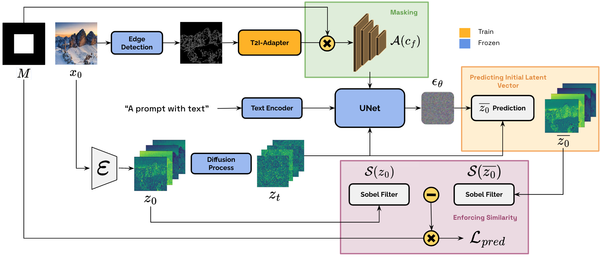

<p align="center">
  
</p>

### <div align="center">Leveraging Latent Vector Prediction for Localized Control in Image Generation via Diffusion Models</div> 

<div align="center">
  <strong>
    <a href="https://scholar.google.es/citations?user=ZWTpskYAAAAJ&hl=es&oi=ao">Pablo Domingo Gregorio</a> · 
    <a href="#">Martí Grau Gasulla</a> · 
    <a href="https://scholar.google.es/citations?user=1eAA6ggAAAAJ&hl=es&oi=ao">Javier Ruiz Hidalgo</a>
  </strong>
</div>

<div align="center">

 &ensp;  

</div> 

---
# 📚 Abstract
>Diffusion models emerged as a leading approach in text-to-image generation, producing high-quality images from textual descriptions. However, attempting to achieve detailed control to get a desired image solely through text remains a laborious trial-and-error endeavor. Recent methods have introduced image-level controls alongside with text prompts, using prior images to extract conditional information such as edges, segmentation and depth maps. While effective, these methods apply conditions uniformly across the entire image, limiting localized control. In this paper, we propose a novel methodology to enable precise local control over user-defined regions of an image, while leaving to the diffusion model the task of autonomously generate the remaining areas according to the original prompt. Our approach introduce a new training framework that incorporates masking features and an additional loss term, which leverages the prediction of the initial latent vector at any diffusion step to enhance the correspondence between the current step and the final sample in the latent space. Extensive experiments demonstrate that our method effectively synthesizes high-quality images with controlled local conditions. Code will be made available once the paper is published.

---


## Methodology Overview
Our proposed methodology introduces precise local control into the text-to-image diffusion process, enabling targeted modifications in user-defined regions of an image. At the core of our approach is the integration of three key components: a textual prompt $p$, a control condition $c_f$, and a mask $M$ that defines the region of interest. 
​1. **Latent Representation Extraction**: The input image $I$ is encoded into its latent representation $z_0$ using an encoder $E$.
2. **Local Control Application**: At each training step $t$, we apply Local Control to the T2I-Adapter features, ensuring that the conditioning information $c_f$ influences only the masked region.
3. **Denoising Process**: A timestep $t$ is sampled, and diffusion noise is added to $z_0$, producing a noisy latent $z_t$. This noisy latent, along with the textual prompt $p$, control features, and mask, is passed through the denoising network $U$, which predicts the noise $\epsilon_{\theta}$.
4. **Initial Latent Prediction and Similarity Enforcement**: Using $\epsilon_{\theta}$ and $z_t$, we predict the initial latent $z_0^{\prime}$. A Sobel filter $S$ is applied to compare edge structures in $z_0$ and $z_0^{\prime}$ within the masked region, enforcing similarity between the original and predicted latents.

This framework allows localized editing while maintaining coherence in the untouched areas, balancing precision with the creative autonomy of the diffusion model.



# 🔧 Dependencies and Installation

- Python >= 3.10 (Recommend to use [Anaconda](https://www.anaconda.com/download/#linux) or [Miniconda](https://docs.conda.io/en/latest/miniconda.html))
- [PyTorch >= 2.0.1](https://pytorch.org/)
```bash
pip install -r requirements.txt
```

# 🔥 How to Train
In order to train T2I-Adapter, you need to run the script `train_adapter.py` with the arguments you want. For example, to train the model with the default parameters, you can run the following command:
```bash
python train_adapter.py 
```
This will use the default configuration in config folder.

Training was conducted on a single NVIDIA A10G Tensor Core GPU with 24GB of memory.
We employed the Adam optimizer with weight decay Loshchilov and Hutter (2019) set to 1×10−2, a learning rate of 8×10−5 and a λ value of 1×10−3. Models were trained with a batch size of 4 and gradient accumulation of 2, effectively simulating a batch size of 8. Training spanned up to 10 epochs with early stopping based on FID scores, evaluated every 10k steps. However, all models converged within a single epoch as FID scores ceased improving. We attribute this rapid convergence to the compact size of the T2I-Adapter and the use of a pre-trained U-Net.

Scripts and Notebooks for evaluation and visualization are located in the `nbs` folder, while the scripts `evaluate_fid.py` and `evaluate_quantitative_metrics.py` are used to evaluate the model.


# 🤗 Acknowledgements
- Thanks to UPC & Napptilus TechLab for providing the necessary resources to carry out this research..

# BibTeX

    @InProceedings{pablo2024leveraging,
      title={Leveraging Latent Vector Prediction for Localized Control in Image Generation via Diffusion Models},
      author={Pablo Domingo-Gregorio, Marti Grau-Gasulla, Javier Ruiz-Hidalgo},
      year={2024}
    }